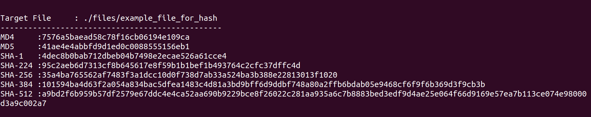
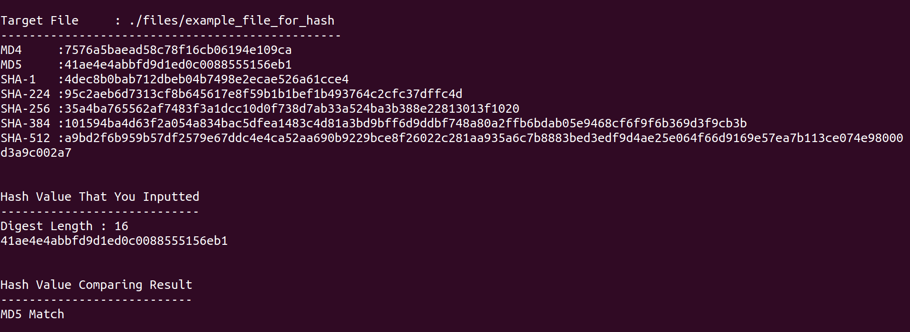
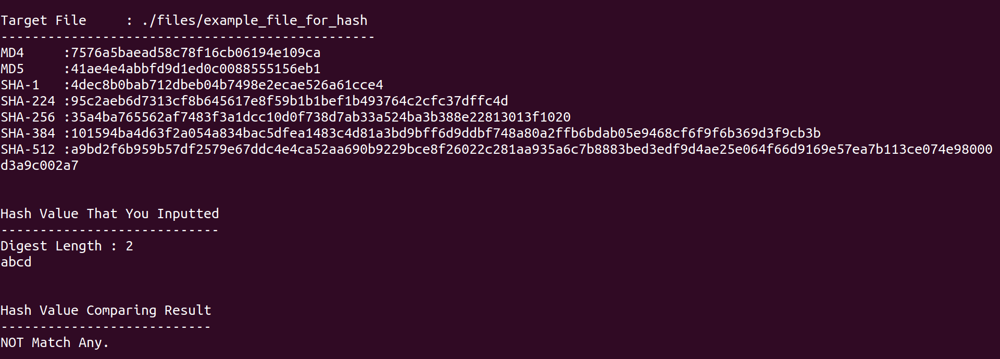

# get-hash-checksum


### HOW TO USE THIS SOFTWARE

### 1. Install development library
```
$ apt install libssl-dev  libncurses-dev
```

&nbsp;&nbsp;&nbsp;libssl-dev is a library for development with openssl related API.  


### 2. Download this repository and make

```
$ cd get-hash-checksum/ && make

# after compiling success, there is a executable file "hash" in root directory. 
```

### 3. get hash value of file

#### get file hash value only

&nbsp;&nbsp;&nbsp;This command will display the hash value of the "example_file_for_hash".

```
$ ./hash  ./files/example_file_for_hash
```



#### get file hash value and comapring with yours

&nbsp;&nbsp;&nbsp;This command will display the hash value of the "example_file_for_hash".

```
$ ./hash  ./files/example_file_for_hash   YOUR_HASH_VALUE_HERE
```

#### MATCH


#### NOT MATCH



Enjoy it, 
if this suit your needs. :)